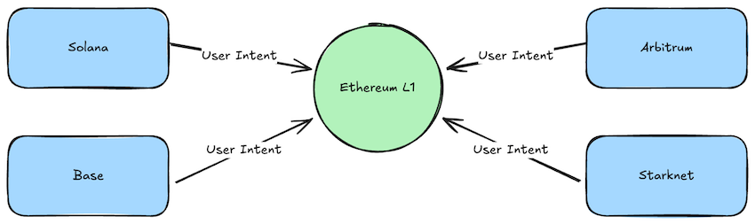
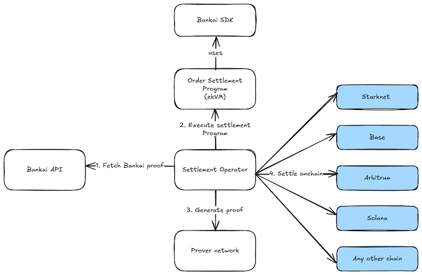

# Bankai: Cross-Chain Settlement Demo

This repository contains a demonstration of a trustless settlement mechanism for an intent-based protocol. It uses [Bankai's](https://www.bankai.xyz) stateless light clients to verify Ethereum L1 state on various source chains (EVM L2s, Solana, Starknet) and [SP1](https://succinct.xyz) to create a verifiable computation of the settlement logic.

The key advantage of this stateless design is the elimination of dedicated, stateful light client contracts. Instead of deploying, maintaining, and perpetually syncing a complex contract on each target chain, this architecture relies on a simple, standard `Groth16` verifier. The verification logic can be exposed as a simple `view` function, making it easy and cheap to integrate while completely removing the burden of on-chain state management and ongoing synchronization costs.

## The Settlement Architecture

In an intent-based protocol, users state their desired outcome, and solvers execute the necessary transactions. A critical component is the settlement layer, which must trustlessly verify that a solver's execution on a destination chain (e.g., Ethereum L1) matches the user's intent before releasing the user's funds on a source chain (e.g., Arbitrum).

This project mocks that flow:



1.  **Mock Orders**: We simulate user intents by submitting "orders" to settlement contracts on various source chains.
2.  **Prove Execution**: A backend process generates a ZK proof attesting that the corresponding transactions were executed on Ethereum L1 and match the order details.
3.  **Settle**: The single ZK proof is used to settle the orders across all source chains.

## Core Technology: Bankai Stateless Light Clients

The settlement mechanism is enabled by Bankai's stateless light clients.

Instead of maintaining a dedicated light client on each source chain, Bankai uses ZK recursion to generate a single, constant-sized proof of Ethereum's history. This proof is synced entirely off-chain and acts as a portable, self-contained certificate of the canonical chain.

Verification is performed on-demand by submitting this proof to a standard `Groth16` verifier contract. This eliminates the need for perpetual, expensive on-chain state synchronization and makes Ethereum's state accessible on any blockchain.

You can monitor the status of the Bankai network and the availability of proofs on the [Bankai Sepolia Dashboard](https://sepolia.dashboard.bankai.xyz/).

## End-to-End Data Flow

The settlement process is divided into off-chain data preparation, zkVM computation, proof generation, and on-chain settlement.


1.  **Data Fetching (Pre-zkVM)**
    *   Bankai's infrastructure maintains an off-chain, recursive proof chain of Ethereum L1's state.
    *   To settle a batch of orders, a backend service uses the [Bankai SDK](https://github.com/bankaixyz/bankai-sdk) to query the Bankai API and retrieve the necessary proofs:
        *   The core Bankai block proof.
        *   MMR proofs for the specific block headers containing the settlement transactions.
    *   The service then fetches the transaction inclusion proofs (Merkle-Patricia proofs) for each settlement transaction from a standard Ethereum RPC endpoint.

2.  **ZK Program Execution (Inside SP1 zkVM)**
    *   The fetched proofs and the list of orders are supplied as inputs to the SP1 program (`program/src/main.rs`).
    *   Inside the zkVM, the program executes the core verification logic using the [Bankai SDK](https://github.com/bankaixyz/bankai-sdk):
        1.  It verifies the Bankai proof, establishing a trustless root of Ethereum's state.
        2.  It verifies the MMR proofs and the transaction inclusion proofs against this state.
        3.  It executes custom logic to assert that the details of the proven transactions (e.g., `to`, `value`) precisely match the specifications of the initial orders.
    *   The program's public output is a Merkle root of all the validated orders.

3.  **Proof Generation**
    *   The execution trace of the SP1 program is sent to the SP1 Prover Network.
    *   The network generates a final, compact `Groth16` proof of the entire computation. This single proof encapsulates the validity of the Bankai state, the transaction inclusion, and the custom matching logic.

4.  **On-Chain Settlement (Using the CLI)**
    *   With the `Groth16` proof generated, the `settlement-cli` tool is used to call the `settleOrders` function on the settlement contracts on the source chains.
    *   Each contract efficiently verifies the single `Groth16` proof, trusts the output Merkle root, and can then process individual order settlements.



The final `Groth16` proof is a self-contained, portable certificate of execution that can be verified on any chain with a standard verifier contract. No chain-specific infrastructure needs to be deployed, maintained and kept in sync using onchain TXs. This is the core advantage enabled by the stateless light client design: it makes trustless cross-chain state verification simple, cheap, and universally accessible.

## Project Components

### 1. SP1 ZK Program (`program/src/main.rs`)

The core verification logic, written in Rust, that runs inside the SP1 zkVM. It verifies Bankai proofs and transaction inclusion, asserts order matching, and outputs a final Merkle root.

### 2. On-Chain Settlement Contracts (`contracts/`)

Smart contracts that mock the on-chain component of an intent protocol. They are deployed on:

-   **EVM** (`contracts/evm`): Base and Arbitrum Sepolia.
-   **Solana** (`contracts/solana`): Solana Devnet.
-   **Starknet** (`contracts/starknet`): Starknet Sepolia.

They expose functions to `submitOrder` and `settleOrders`.

### 3. Settlement CLI (`script/src/bin/cli.rs`)

A command-line tool to orchestrate the demo. Its primary roles are to mock order submission (`submit`), settle proven orders (`settle`), and reset on-chain state for subsequent runs (`reset`).

## How to Run the Demo

### Requirements

-   [Rust](https://rustup.rs/)
-   [SP1](https://docs.succinct.xyz/docs/sp1/getting-started/install)

### 1. Installation & Setup

```sh
# Clone the repository
git clone https://github.com/succinctlabs/settlement-demo.git
cd settlement-demo

# Set up environment variables
cp .env.example .env
```

Open `.env` and configure it with your RPC endpoints and private keys.

### 2. Run the Settlement Flow

All of the following commands should be run from within the `script` directory.

```sh
cd script
```

**Step 1: Reset State (Optional)**

To ensure a clean state, reset the deployed contracts.

```sh
# Dry run
cargo run --release --bin cli -- reset all --dry-run

# Execute
cargo run --release --bin cli -- reset all
```

**Step 2: Submit Mock Orders**

The `txs.json` file in the project root contains a list of mock transactions that simulate user intents. Use the `submit` command to post these orders to the settlement contracts on your desired source chains.

```sh
cargo run --release --bin cli -- submit base-sepolia
cargo run --release --bin cli -- submit arbitrum-sepolia
cargo run --release --bin cli -- submit solana-devnet
cargo run --release --bin cli -- submit starknet-sepolia
```

**Step 3: Generate the Settlement Proof**

This step runs the SP1 program with the mock transaction data to generate the final ZK proof.

```sh
RUST_LOG=info cargo run --release -- --prove
```

This command generates a `proof.json` file in the project root containing the public values and the `Groth16` proof.

**Step 4: Settle Orders on a Source Chain**

Use the generated `proof.json` to settle the orders on a source chain.

```sh
# Settle orders on Base Sepolia
cargo run --release --bin cli -- settle base-sepolia

# Settle orders on Arbitrum Sepolia
cargo run --release --bin cli -- settle arbitrum-sepolia

# Settle orders on Solana Devnet
cargo run --release --bin cli -- settle solana-devnet

# Settle orders on Starknet Sepolia
cargo run --release --bin cli -- settle starknet-sepolia
```

The contract verifies the proof, and the orders are marked as settled on-chain.

## Live Demo Examples

Here are some links to live transactions from a deployment of this demo:

-   **Succinct Proof Request**: [View on Succinct Explorer](https://explorer.succinct.xyz/request/0x46ee3e9a8c4d303fcf4d9c4a76ed854bb1a6f5ed3a14c2e5aa32c7792701af0e)
-   **Base Sepolia Settlement (6 orders)**: [View on Basescan](https://sepolia.basescan.org/tx/0x4064960d3c88e284bb0d85d92aa4b4ce34bad01f92890e5b7996ad2dd6ae0253)
-   **Arbitrum Sepolia Settlement (12 orders)**: [View on Arbiscan](https://sepolia.arbiscan.io/tx/0xa706725cd24f6a9a2bb512edd7296dbd7b75de375e242e2293cf3fd5af2f4330)
-   **Starknet Sepolia Settlement (1 order)**: [View on Voyager](https://sepolia.voyager.online/tx/0x22d3dfaf46fe113099b0bd16985a0273b3a378a7706c479ef8e0d5e3d84c46)
-   **Solana Devnet Contract**: [View on Solscan](https://solscan.io/account/HpgNxwdekXixEW6ZzTPsjhhFx46fpfoC7ruJvsinPYHx?cluster=devnet)
